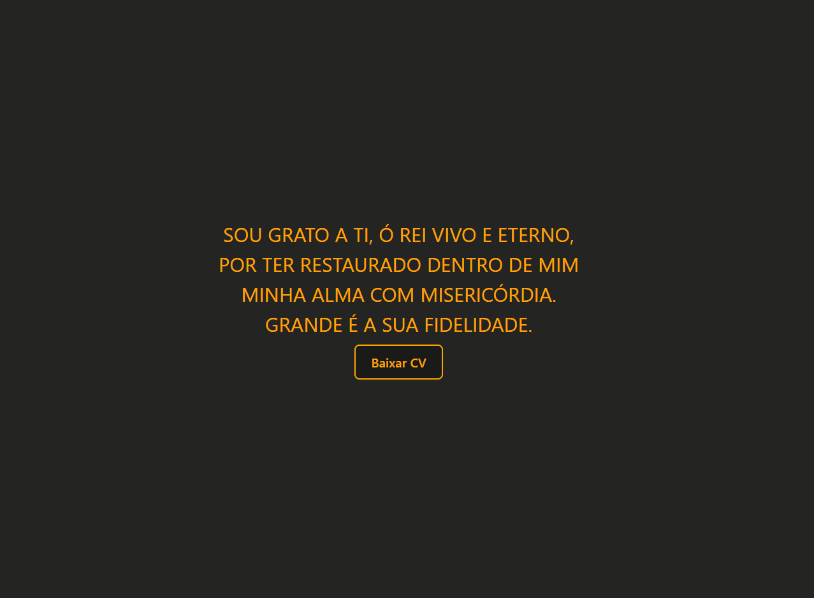

# React + Vite

# Quest React Base
Desafio proposto no curso DevQuest - DevEmDobro, no módulo de React base.

## Desafio 💻

### 🟣 Criar um parágrafo

- Criação de um componente que renderiza na tela um parágrafo ( colorido ) e com formatação ( uppercase ) usando JS.
- Usando as props para passar o texto e a cor de texto desejado para dentro do componente.

🟣 Criação de um componente Button com um evento de clique que apresenta um alerta informando a prop label do botão que
foi clicado, com a seguinte mensagem: "A label desse botão é baixar CV.

## Técnologias utilizadas

## Layout

#####
#### By: Julio Resende
#####
# FIM
